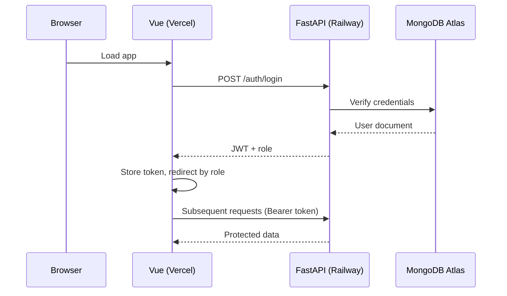

# LeaveDesk

Employees apply for leave. Employers approve or reject. Built with Vue 3, FastAPI, and MongoDB Atlas.

**Live demo:** `https://leave-desk.vercel.app` · **API docs:** `https://leavedesk-production.up.railway.app/docs`

---

## Architecture



---

## Stack

| Layer    | Tech                           |
|----------|--------------------------------|
| Frontend | Vue 3 + Vite + Tailwind CSS    |
| State    | Pinia                          |
| Backend  | FastAPI + python-jose + bcrypt |
| Database | MongoDB Atlas                  |
| Deploy   | Railway (API) + Vercel (UI)    |

---

## Structure

```
leavedesk/
├── backend/
│   ├── main.py              # all routes, auth, middleware, DB
│   ├── requirements.txt
│   ├── Dockerfile
│   └── .env.example
├── frontend/
│   ├── src/
│   │   ├── views/           # Login, Register, Employee, Employer
│   │   ├── components/      # StatusBadge, ToastContainer
│   │   ├── composables/     # useToast
│   │   ├── stores/          # auth (Pinia)
│   │   └── router/          # index.js + nav guards
│   ├── Dockerfile
│   ├── nginx.conf
│   └── .env.example
└── docker-compose.yml
```

---

## Local Setup

```bash
cp backend/.env.example backend/.env     # fill in MONGO_URI and JWT_SECRET
cp frontend/.env.example frontend/.env  # set VITE_API_URL
docker compose up --build
```

| Service  | URL                       |
|----------|---------------------------|
| Frontend | http://localhost:5173      |
| Backend  | http://localhost:8000      |
| API docs | http://localhost:8000/docs |

**Without Docker:**
```bash
# Backend
cd backend && pip install -r requirements.txt
uvicorn main:app --reload

# Frontend
cd frontend && npm install && npm run dev
```

---

## Environment Variables

**`backend/.env`**
| Variable             | Description                     |
|----------------------|---------------------------------|
| `MONGO_URI`          | MongoDB Atlas connection string |
| `JWT_SECRET`         | Secret for signing JWTs         |
| `JWT_EXPIRE_MINUTES` | Token lifetime (default 1440)   |

**`frontend/.env`**
| Variable       | Description          |
|----------------|----------------------|
| `VITE_API_URL` | Backend base URL     |

---

## API

### Auth
| Method | Endpoint         | Body                            |
|--------|------------------|---------------------------------|
| POST   | `/auth/register` | `{ email, password, role }`     |
| POST   | `/auth/login`    | form-data: `username, password` |

### Leaves
| Method | Endpoint                 | Role     |
|--------|--------------------------|----------|
| POST   | `/leaves`                | employee |
| GET    | `/leaves/mine`           | any      |
| GET    | `/leaves?status=Pending` | employer |
| PATCH  | `/leaves/{id}/approve`   | employer |
| PATCH  | `/leaves/{id}/reject`    | employer |
| GET    | `/health`                | —        |

---

## Deployment

**Backend → Railway:** New project from GitHub → root directory `backend` → add env vars → Railway uses the Dockerfile automatically.

**Frontend → Vercel:** Import repo → root directory `frontend` → add `VITE_API_URL=https://your-backend.up.railway.app` → deploy.

---

## Beyond the Spec

- **Rate limiting** — `slowapi` limits login to 5 req/min and registration to 10 req/min per IP
- **Request logging middleware** — every request logs method, path, status code, and duration
- **MongoDB indexes** — on `email` (unique), `employee_id`, and `status` for query performance
- **Pydantic v2 cross-field validation** — `end_date >= start_date` enforced at the schema level
- **Multi-stage Docker build** — Node builds the Vue app, output copied into `nginx:alpine` (~25MB, no Node runtime in prod)
- **nginx SPA fallback** — `try_files` ensures Vue Router's HTML5 history mode works on hard refresh
- **Toast composable** — lightweight notification system with no external library